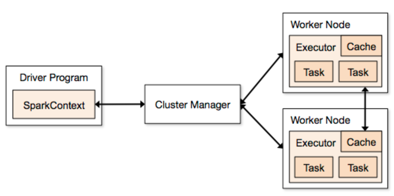

# MapReduce-based Federated Learning for Landmark Recognition

## 1. Parts of Spark

* Partitions
  A partition is a small chunk of a large distributed data set.
Spark manages data using partitions that helps parallelize data processing with minimal data shuffle across the executors.

* Task
  A task is a unit of work that can be run on a partition of a distributed dataset and gets executed on a single executor.
The unit of parallel execution is at the task level.
All the tasks with-in a single stage can be executed in parallel

* Executor
  An executor is a single JVM process which is launched for an application on a worker node.
Executor runs tasks and keeps data in memory or disk storage across them.
Each application has its own executors. A single node can run multiple executors
and executors for an application can span multiple worker nodes.
An executor stays up for the duration of the Spark Application and runs the tasks in multiple threads.
The number of executors for a spark application can be specified inside the SparkConf
or via the flag –num-executors from command-line.

### References
[Spark structure post](http://site.clairvoyantsoft.com/understanding-resource-allocation-configurations-spark-application/)

## 2. Data Preprocessing

### 1. Python

Example of use:

`python preprocess.py -d train.csv -p D:\your\target\path`

* -d/--data: the data file path.
* -s/--data_set: `train`, `index`, or `test`.
* -p/--path: the path where to download the images.
* -c/--clear: `True` if the specified directory is to be cleared, otherwise `False`.
* -u/--upper: The upper bound of number of images in each category.
* -l/--lower: The lower bound of number of images in each category.
* -m/--max_categories: The number of categories to be sampled.
* -n/--num_machines: The number of machines.
* -r/--random_state: The random state.

For more details, refer to the [Source Code](https://github.com/CoderStellaJ/CS4225-Big-Data-System-Project/blob/master/data_preprocessing/preprocess.py).
